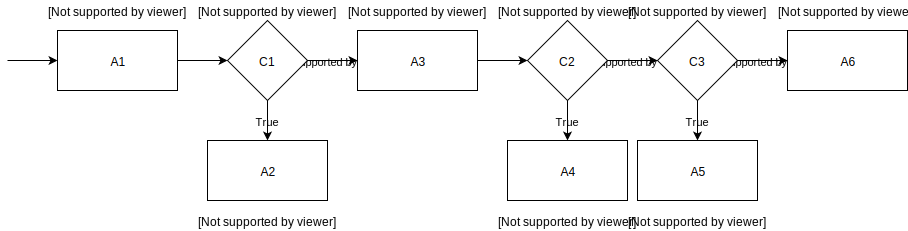

# Report for assignment 4

## Project

Name: Strongbox

URL: https://github.com/strongbox/strongbox

Strongbox is an Artifact Repository Manager written in Java which allows you to store binary artifacts. It aims to be an easy an reliable platform and supports any repository layout.

## Architectural overview (optional, as one item for P+)

The Strongbox project consists of several core modules listed below with its corresponding `README.md` shortly describing its content and purpose: 

- [strongbox-client](https://github.com/strongbox/strongbox/tree/master/strongbox-client)/  
This is where the artifact client resides.
- [strongbox-commons](https://github.com/strongbox/strongbox/tree/master/strongbox-commons)/  
This is where the most common code which is across other modules resides.
- [strongbox-event-api](https://github.com/strongbox/strongbox/tree/master/strongbox-event-api)/  
Contains an event API.
- [strongbox-metadata-core](https://github.com/strongbox/strongbox/tree/master/strongbox-metadata-core)/  
This contains the most commonly needed code related to Maven metadata.
- [strongbox-parent](https://github.com/strongbox/strongbox-parent/tree/master)  
This is the Maven parent which is (and should be) inherited by all modules. It is the right (and only place) to define versions for dependencies and plugins. Versions of dependencies should not be defined in any other pom.xml files in order to ease the maintenance of these across the codebase.
- [strongbox-resources](https://github.com/strongbox/strongbox/tree/master/strongbox-resources)/  
This is the place where common resources which can be used by multiple projects reside. The idea is not have to duplicate things such as `logback.xml`, `web.xml`, keystores and so on across the other modules. These resources are copied using the `maven-dependency-plugin`.`
  - [strongbox-common-resources](https://github.com/strongbox/strongbox/tree/master/strongbox-resources/strongbox-common-resources)/  
Contains `logback.xml` and keystores.
  - [strongbox-storage-resources](https://github.com/strongbox/strongbox/tree/master/strongbox-resources/strongbox-storage-resources)/  
    - [strongbox-storage-api-resources](https://github.com/strongbox/strongbox/tree/master/strongbox-resources/strongbox-storage-resources/strongbox-storage-api-resources)/
Contains the `strongbox.xml` configuration file.
    - [strongbox-web-resources](https://github.com/strongbox/strongbox/tree/master/strongbox-resources/strongbox-web-resources)/  
Contains the `web.xml` and the Jetty configuration files.
- [strongbox-rest-client](https://github.com/strongbox/strongbox/tree/master/strongbox-rest-client)/  
Contains the REST API client.
- [strongbox-security-api](https://github.com/strongbox/strongbox/tree/master/strongbox-security-api)/  
Contains various security and encryption related classes.
- [strongbox-storage](https://github.com/strongbox/strongbox/tree/master/strongbox-storage)/  
Contains the code for the storage related modules.
  - [strongbox-storage-api](https://github.com/strongbox/strongbox/tree/master/strongbox-storage/strongbox-storage-api)/  
Contains the most common code for storages (`Storage`, `Repository`, `*LocationResolver`, etc)
  - [strongbox-storage-indexing](https://github.com/strongbox/strongbox/tree/master/strongbox-storage/strongbox-storage-indexing)/  
Contains the Lucene indexing code.
  - [strongbox-storage-metadata](https://github.com/strongbox/strongbox/tree/master/strongbox-storage/strongbox-storage-metadata)/  
Contains a service wrapper and XML marshalling/unmarshalling for Maven metadata.
- [strongbox-testing](https://github.com/strongbox/strongbox/tree/master/strongbox-testing)/  
Contains various very useful base classes for testing
  - [strongbox-testing-core](https://github.com/strongbox/strongbox/tree/master/strongbox-testing/strongbox-testing-core)/  
Contains code for generation of valid Maven artifacts.
  - [strongbox-testing-web](https://github.com/strongbox/strongbox/tree/master/strongbox-testing/strongbox-testing-web)/  
Contains a dummy implementation of a Jersey application. Sometimes useful for lightweight tests.
- [strongbox-web-core](https://github.com/strongbox/strongbox/tree/master/strongbox-web-core)/  
This is the web module which contains all the controllers.

## Selected issue(s)

Title: HandlerMethodArgumentResolver to resolve Repository instance based on `{storageId}/{repositoryId}` path variables #528

URL: https://github.com/strongbox/strongbox/issues/528

The issue request an new repository mapping argument resolver which will check the validity of a given repository. This handler could be used in many parts of the project but the example given in the issue is to add the resolver to the ThrashController.

## Onboarding experience

There are build instructions in the projects `README.md`. Some of the links are dead which was annoying and shows a lack of care from the projects side. However we were able to build the project without much hickup anyway.

It should be noted that we have not found a way to run a specific test suite 
without rebuilding the whole project. If we simply attempt to run the tests 
multiple times with `mvn test` multiple tests will fail which didn't fail during
program compilation. This can be quite an annoyance since the whole project
takes about 10 minutes to build on a 5:th generation i5 processor.

## Requirements affected by functionality being refactored

## Existing test cases relating to refactored code

The existing test cases for the `delete` and `undelete` [TrashController](./strongbox-web-core/src/main/java/org/carlspring/strongbox/controllers/TrashController.java) 
function works by creating artificial repositories with different properties, 
performing the operations and asserting that the `delete/undelete` operation 
was successfully performed. This is done by simulating/mocking a POST request
for these specific operations. While the existing tests ensure that the operations
are are successful on artificially generated repos there are a lot of different 
cases which are not accounted for. There are for instance no tests which would 
result in the operation failing (such as attempting to delete/undelete data 
from a non-existing repo). Since the tests doesn't test the functions directly 
(they relay on mocked POST requests) a failure in another method might cause a 
test to fail. This is handled by asserting on different error messages. The 
existing TrashController tests should be considered integration tests rather 
than as unit tests.

## Test requirements 

### RepositoryMappingArgumentResolver

We implement full node-coverage (NC) for the `RepositoryMappingArgumentResolver`
class. The condensation graph below provides a overview of the structure of the 
`resolveArgument` function. In addition to this both outcomes of `supportsParameter`
are tested as well. The tests are implemented in [RepositoryMappingArgumentResolverTest](./strongbox-web-core/src/test/java/org/carlspring/strongbox/controllers/RepositoryMappingArgumentResolverTest.java).



```
C1: storage == null
C2: repository == null
C3: !repository.isInService()
```

#### Test requirements

**TR1:** n0

**TR2:** n1

**TR3:** n2

**TR4:** n3

**TR5:** n4

**TR6:** n5

**TR7:** n6

**TR8:** n7

**TR9:** n8

**TR10:** supportsParameter() == true

**TR11:** supportsParameter() == false


## The refactoring carried out

UML before refactor: [https://repository.genmymodel.com/alan.ihre/se-assignment-4-old](https://repository.genmymodel.com/alan.ihre/se-assignment-4-old).

UML after refactor: [https://repository.genmymodel.com/alan.ihre/se-assignment-4](https://repository.genmymodel.com/alan.ihre/se-assignment-4).

## Test logs

Overall results with link to a copy of the logs (before/after refactoring).

The refactoring itself is documented by the git log.

## Effort spent

On average each member of the group spent the following time doing:  

1. plenary discussions/meetings; 1.5 hours

2. discussions within parts of the group; 3 hours

3. reading documentation;  3 hours

4. configuration; 1 hour

5. analyzing code/output; 2 hours

6. writing documentation; 6 hours

7. writing code; 6 hours

8. running code? 2 hours

## Overall experience

It can be hard to clearly understand the issues of a new project since they are written with a different target audience. 
For us as an external helping hand it's important for the documentation to be well written so we can easily get started with the project. Since this is not the larged project out there, but we still ran into some issues with e.g. onboarding, this shows the impotance of good documentation throughout code, text-files and links etc. 

## Contributions
Max: Documentation and report
Anton: Documentation and report
Erik: Setting up repository and Jenkins, refactoring
Nicklas: Responsible for testing
Alan: Refactoring and UML
